# Secured Voting System
The "Secure Voting System" is a software application developed to facilitate secure and efficient voting processes in elections. The system aims to modernize traditional voting methods by providing a platform for voters to cast their votes conveniently, while ensuring the integrity and security of the voting process.


Key Features :

1) User Registration and Authentication: The system allows voters to register and authenticate their identities using their unique voter ID, ensuring that only eligible voters can participate in the election.

2) We can have all data regarding stored in the file live, so we don't need to worry about any type of data loss.

By developing the "Secure Online Voting System," we aim to enhance the efficiency, convenience, and security of the voting process, thereby encouraging broader participation and fostering trust in democratic practices.
<br>
## CODE SCREENSHOTS

1) Main Logic code: 

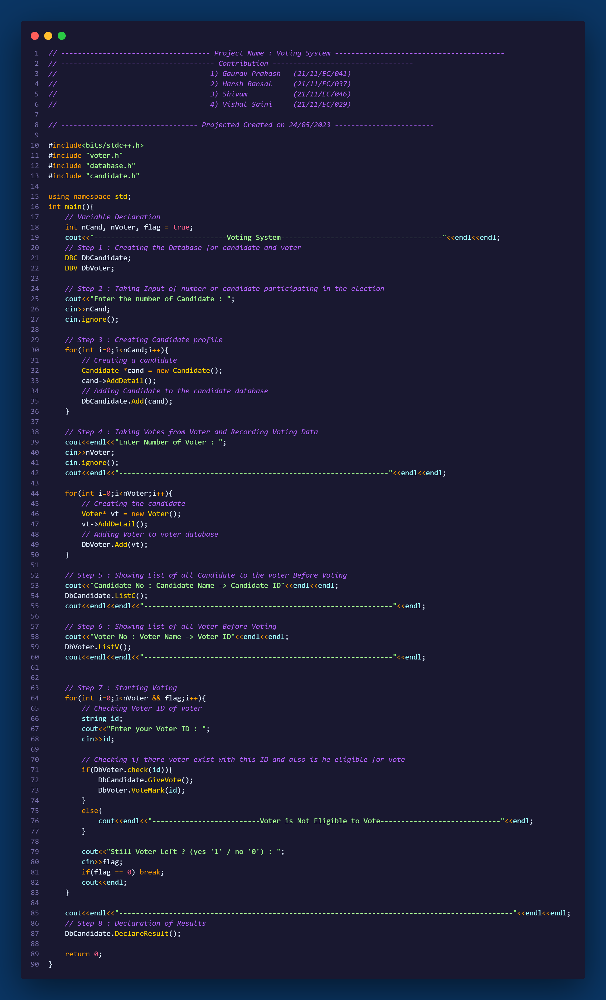

2) Database:

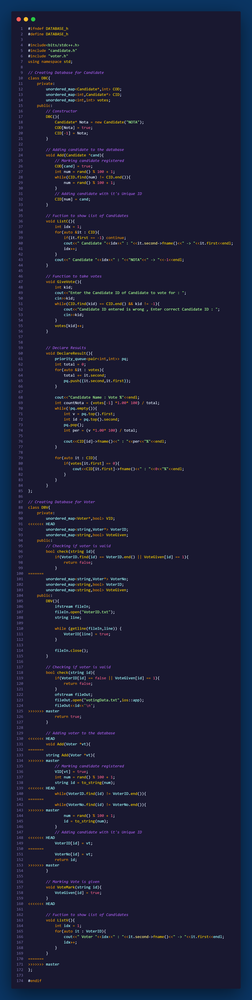

3) Candidate

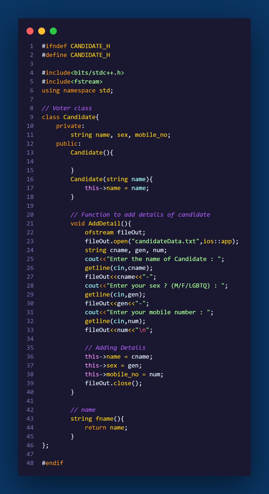

4) Voter

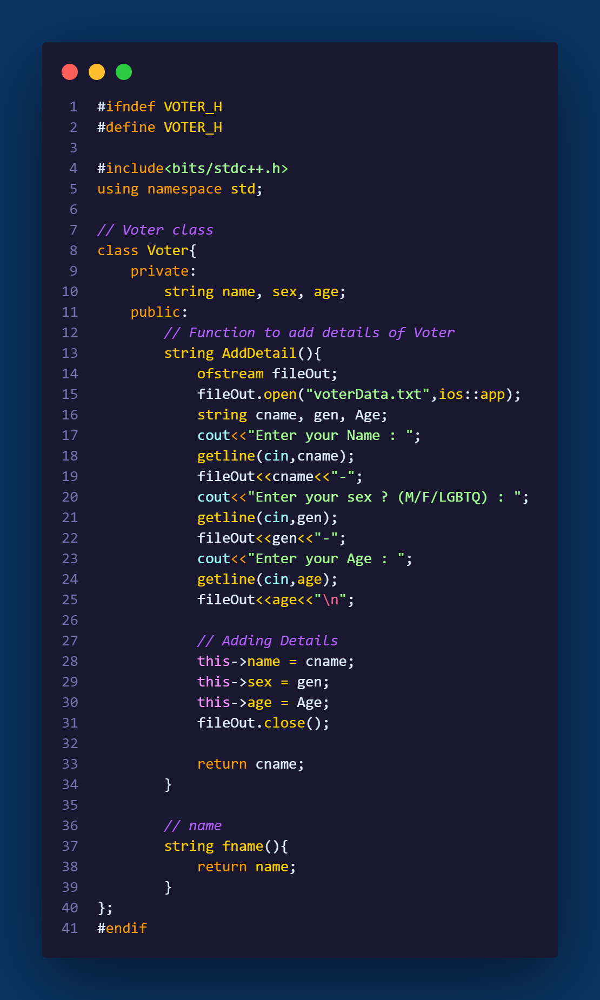


## How to use the project ?
- Download the Project from here : [Download](https://drive.google.com/file/d/1bnqoZfKnGSKKYWdmmRNZn2Zc0r6Uo2N3/view?usp=sharing)

- Extract the folder

- Open the **'inputData.txt'** file and write number of candidate and number of voter respectively after a space b/w them **(See below)**.
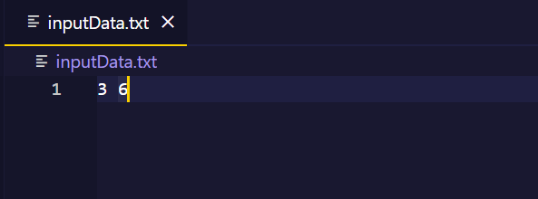

- Same do for **'VoterID.txt'** but here put the **voter id** of the voters. Note : Put each VoterID in new line **(See below)**.
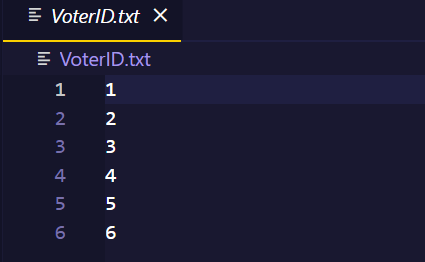

- Now run the code present in **'main.cpp'** file

- **Welcome Screen will appear**
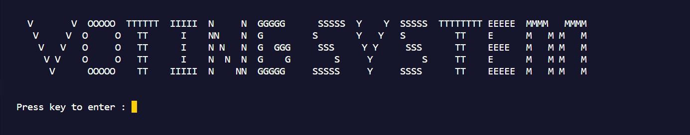

- Candidate detail's will be taken before starting voting. **Screen will be cleared after a candidate fill his details**
```
Candidate 1 : Entering his details
```
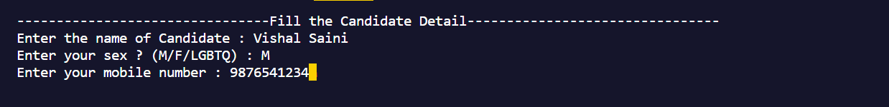
```
Candidate 2 : Entering his details
```
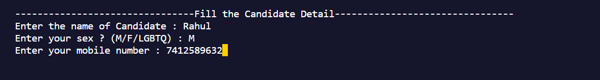
```
Candidate 3 : Entering his details
```
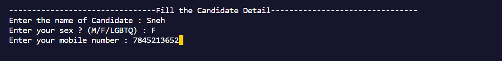

- Now we should ask for detail of voter before he can cast the vote. **Screen will be cleared after voter cast the vote**
```
Voter 1 casting the vote
```
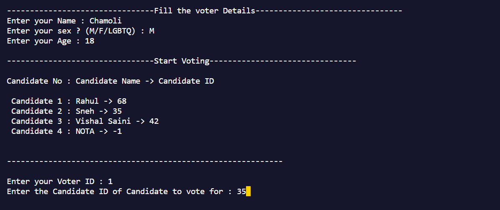
```
Voter 2 casting the vote
```
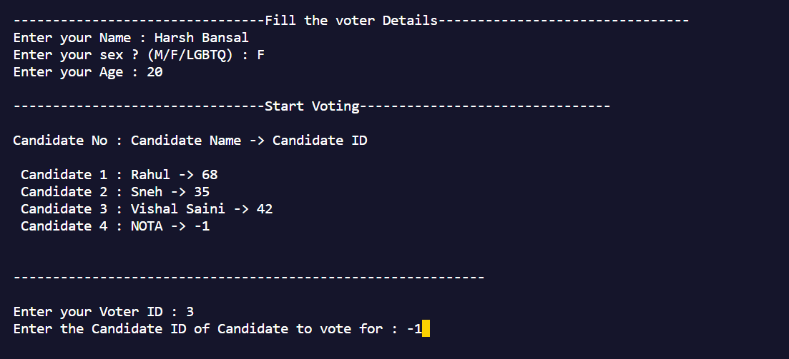
```
Voter 3 casting the vote
```
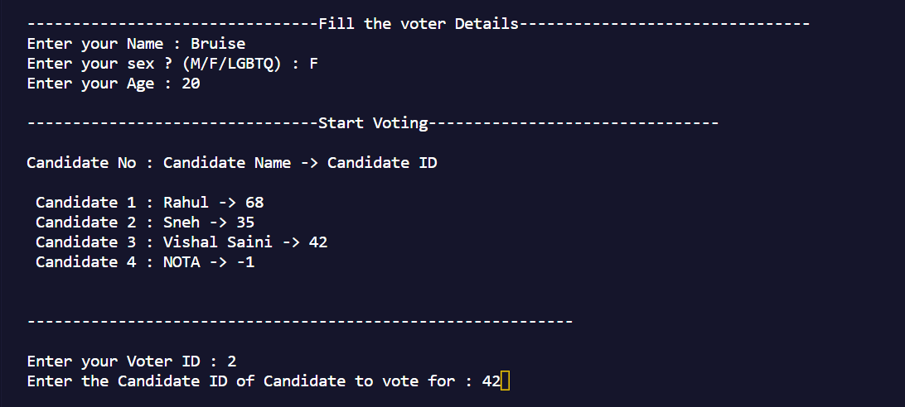
```
Voter 4 casting the vote
```
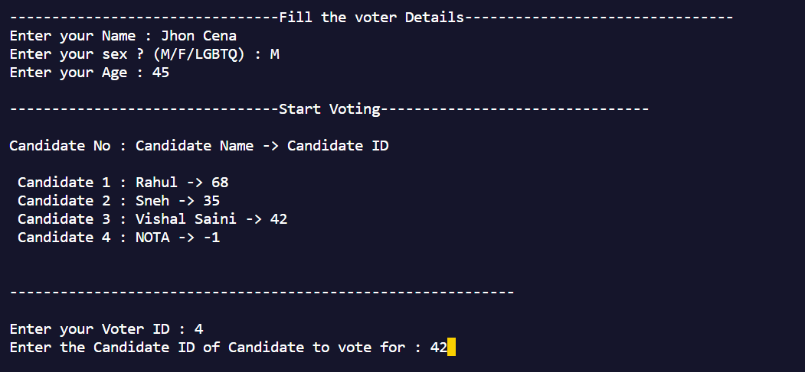
```
Voter 5 casting the vote
```
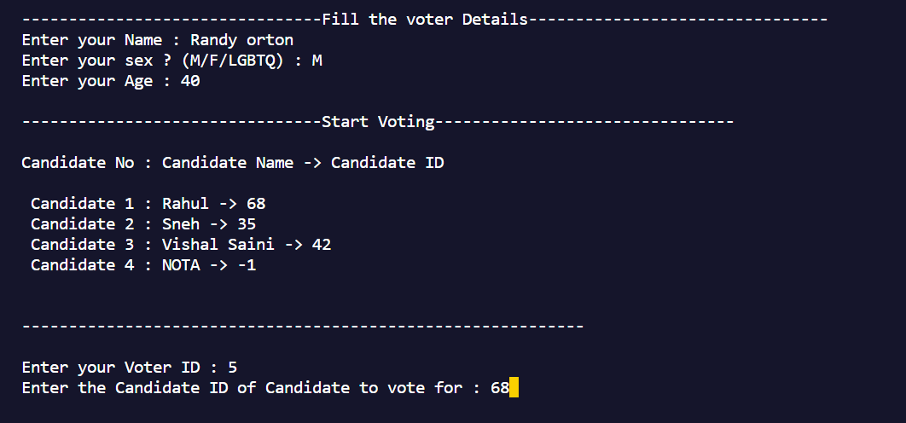
```
Voter 6 casting the vote
```
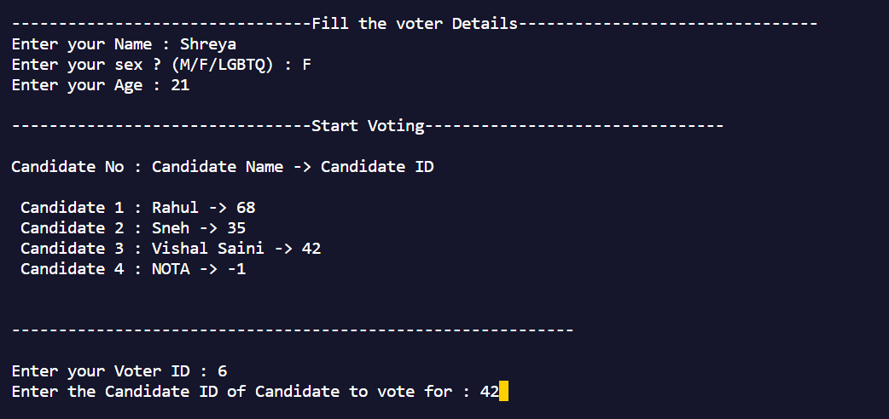

- **Voting Results**
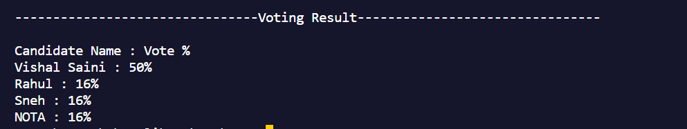

- All the voting data can be accessed using the files below

```
'voterData.txt' file store the data of voter who casted the vote successfully.
```
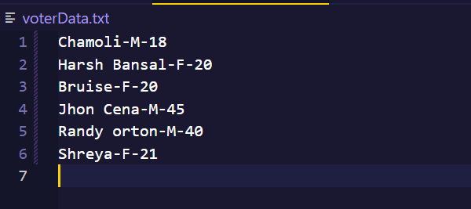

```
'votingData.txt' file store the data of voting id of candidate who successfully casted the vote.
```


## FAQ

**Question 1 Tech stack and methodology Used**

"We have employed the power of C++ programming language, along with the robust principles of Object-Oriented Programming (OOP) methodology, to construct this secure voting system."


## Acknowledgements

 - [ZebraCode(YT)](https://www.youtube.com/watch?v=aq-eYnsCoP0&ab_channel=ZebraCode)
 - [Book](http://sriyncollege.org/wp-content/uploads/2021/08/ELECTRONIC-VOTING-MACHINE-DOCUMENTATION.pdf)


## Authors

- [@Chamoli2k2](https://github.com/Chamoli2k2)
- [@Harshbansal0001](https://www.github.com/Harshbansal0001)
- [@Shivambruice](https://www.github.com/Shivambruice)
- [@VishalSaini2809](https://www.github.com/VishalSaini28)

<a href="https://github.com/Chamoli2k2/Secured-Voting-System/graphs/contributors">
  
</a>
