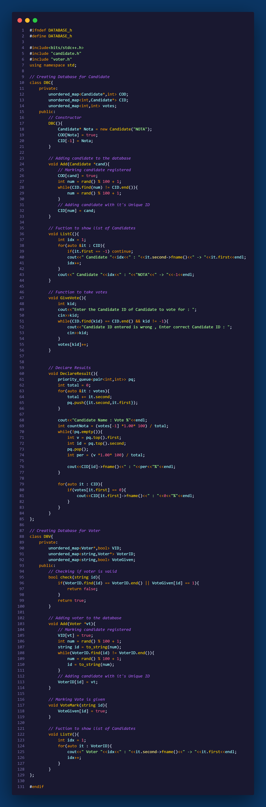
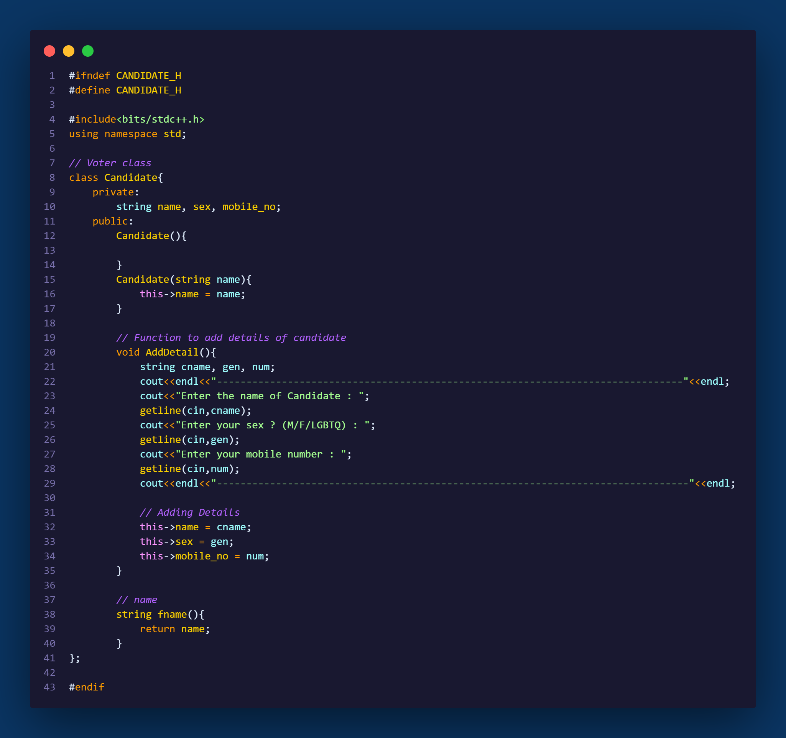
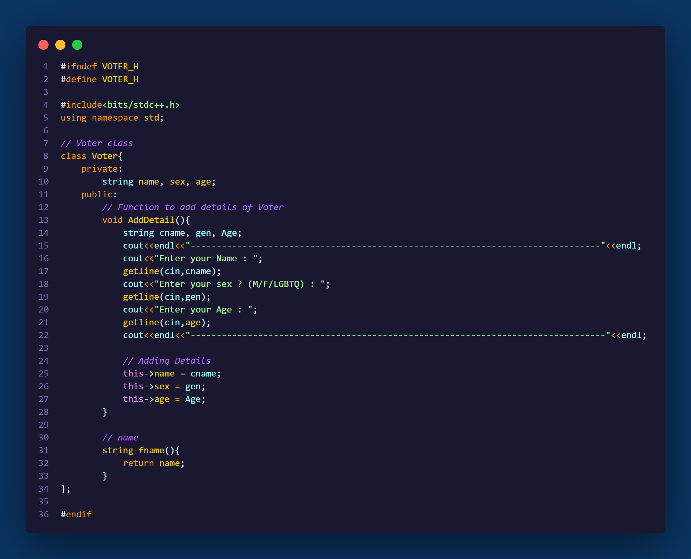

# Secured Voting System
The "Secure Voting System" is a software application developed to facilitate secure and efficient voting processes in elections. The system aims to modernize traditional voting methods by providing a platform for voters to cast their votes conveniently, while ensuring the integrity and security of the voting process.

Key Features :

1) User Registration and Authentication: The system allows voters to register and authenticate their identities using their unique voter ID, ensuring that only eligible voters can participate in the election.

2) Candidate Management: Administrators can add, update, or remove candidates as needed.

By developing the "Secure Online Voting System," we aim to enhance the efficiency, convenience, and security of the voting process, thereby encouraging broader participation and fostering trust in democratic practices.
 
## CODE SCREENSHOTS

1) Main Logic code: 

2) Database:

3) Candidate

4) Voter

## FAQ

**Question 1 Tech stack and methodology Used**

"We have employed the power of C++ programming language, along with the robust principles of Object-Oriented Programming (OOP) methodology, to construct this highly secure voting system."

## Acknowledgements

 - [ZebraCode(YT)](https://www.youtube.com/watch?v=aq-eYnsCoP0&ab_channel=ZebraCode)
 - [Book](http://sriyncollege.org/wp-content/uploads/2021/08/ELECTRONIC-VOTING-MACHINE-DOCUMENTATION.pdf)

## Authors

- [@Chamoli2k2](https://github.com/Chamoli2k2)
- [@Harshbansal0001](https://www.github.com/Harshbansal0001)
- [@Shivambruice](https://www.github.com/Shivambruice)
- [@VishalSaini2809](https://www.github.com/VishalSaini28)

